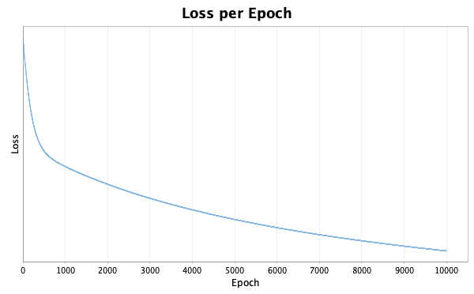

# Logistic Regression in Scala

This project has two parts, that are also two separate scala projects that should be run separately. The two main objectives are:

1. Implement logistic regression in DJL

<p align="center">
  
</p>

2. Try to optimize memory usage

<p align="center">
  
</p>

# 1- Logistic Regression using DJL

## Project Overview and Features

This project implements a logistic regression model in Scala using the Deep Java Library (DJL) for numerical computations. Its functionality is limited, it can read csv files assuming the last column consists of labels, it preprocesses them accordingly and works for multiple dimensional weights. If the input data is in 2D, then it plots the results: training data, test data and the decision boundary.

- Implementation of logistic regression using gradient descent
- Works for both 2D and higher-dimensional datasets
- Data preprocessing including min-max feature scaling
- Model evaluation with accuracy metric
- Visualization of 2D data and decision boundary
- Loss history plotting
- Memory usage monitoring (only printed out)

## Project Structure

The first part of the project consists of the following main Scala files inside the coding-challenge directory:

- `Main.scala`: The entry point of the application, I tried to keep it as simple as possible
- `LogisticRegression.scala`: Contains the logistic regression
- `Tools.scala`: Includes utility functions: gradient descent, loss calculation, activation functions, data preprocessing, evaluation, and file reading
- `Plotter.scala`: Handles data visualization and plotting only for 2D

## Dependencies

- Deep Java Library (DJL): For NDArray operations
- Breeze: For plotting
- Scala standard library

## Usage

1. Prepare your data in CSV format with features in columns and the label in the last column.
2. Update the `filename` and `testFilename` variables in `Main.scala` to point to your training and test data files.
3. Adjust hyperparameters such as `learningRate` and `epochs` in `Main.scala` if needed.
4. Run the main application:
   ```
   sbt run
   ```

## Example

When it is tested on 2D data, it will create two plots: loss per epoch, and the decision boundary with the input data.

<p align="center">
  
</p>

<p align="center">
  
</p>

When it is tested on 3D data, it will create the loss per epoch plots. But the results and the data, when plotted in a more 3D-friendly environment (I used plotly), we get the result below.

<p align="center">
  
</p>

Independent of the dimensions of the data, the model will log something similar to,

```bash
Epoch 9500, Loss: 0.02504361
Epoch 10000, Loss: 0.023912188

Data visualization is only available for 2D data. Current data has 3 dimensions.

Final weights: ND: (3, 1) cpu() float32
[[0.902 ],
 [0.72  ],
 [0.3933],
]

Final bias: ND: (1, 1) cpu() float32
[[0.3713],
]


Test accuracy: 100.00%

```

And the memory monitoring relative to the initial state of the program will be shown last, note that this is deliberately non-optimized memory usage case, so that we can compare it with the optimized version.

```bash
Relative Memory Usage (relative to initial):
Step 0: 0 B (0.00%)
Step 1: 2.8 MB (3.53%)
Step 2: 1.3 MB (1.64%)
Step 3: 1.3 MB (1.68%)
Step 4: 65.9 MB (83.95%)
Step 5: 64.9 MB (82.74%)
Step 6: 77.5 MB (98.75%)
Step 7: 13.5 MB (17.17%)
```

Steps are representing:

- **Step 0**: Initial memory state
- **Step 1**: After data loading
- **Step 2**: After data preprocessing
- **Step 3**: After model training
- **Step 4**: After prediction
- **Step 5**: After evaluation
- **Step 6**: After visualization

# 2- Attempt of memory optimization

<p align="center">
  
</p>

This project implements a logistic regression model in Scala, designed for efficient memory usage and performance. It includes features such as data streaming, mini-batch processing, and feature scaling. Its final results, when compared with the non-memory optimized Scala implementation's results or sklearn results are shown above. Note that for memory measurements, I had some options such as to use garbage collection, to use garbage collection only once, not to use garbage collection etc. But in my local environment, it was indeed difficult to get accurate measurements. I provide some of the results out of my experimentation. Nonetheless from the time of execution perspective, or time per epoch measure, this version is significantly faster. Since there are plotting involved in the previous version it is not a good measure to directly compare the complete time of executions of the program, nonetheless the measurements shows around an order of magnitude difference.

- Logistic Regression model implementation
- Data streaming from file
- Mini-batch processing
- Feature scaling (Min-Max Normalization)

## Project Structre

The second part is a separate scala project with the following structure:

- `Main`: The main object containing the entry point and training logic
- `LogisticRegressionModel`: Class implementing the logistic regression model
- Utility functions:
  - `getCurrentMemoryUsage`: Measures current memory usage
  - `streamData`: Streams data from a file
  - `createMiniBatches`: Creates mini-batches from the input data
  - `scaleFeatures`: Performs min-max normalization on the features

## Configuration

You can modify the following parameters in the `Main` object:

- `filename`: The input data file
- `batchSize`: Size of mini-batches
- `epochs`: Number of training epochs
- `learningRate`: Learning rate for gradient descent

## Output

The program will output in the console. Something like,

```bash
[info] running Main

Total Memory: 1073.741824
Epoch 500, Loss: 0.2475
Epoch 1000, Loss: 0.1509
Epoch 1500, Loss: 0.1078
Epoch 2000, Loss: 0.0838
Epoch 2500, Loss: 0.0687
Epoch 3000, Loss: 0.0582
Epoch 3500, Loss: 0.0506
Epoch 4000, Loss: 0.0448
Epoch 4500, Loss: 0.0402
Epoch 5000, Loss: 0.0365
Epoch 5500, Loss: 0.0334
Epoch 6000, Loss: 0.0308
Epoch 6500, Loss: 0.0286
Epoch 7000, Loss: 0.0267
Epoch 7500, Loss: 0.0251
Epoch 8000, Loss: 0.0236
Epoch 8500, Loss: 0.0223
Epoch 9000, Loss: 0.0212
Epoch 9500, Loss: 0.0202
Epoch 10000, Loss: 0.0192

Final weights:
0.9583308, 0.6460672, 0.44807142
Final bias: 0.3671

Total Memory: 1073.741824

Free Memory Usage:
Step 0: 948.56 MB
Step 1: 946.47 MB
Step 2: 557.97 MB
Step 3: 557.97 MB
[success] Total time: 1 s, completed Jul 3, 2024, 2:44:18 PM

```

And as a summary of collection of memories at different steps:

<p align="center">
  
</p>

## License

MIT
